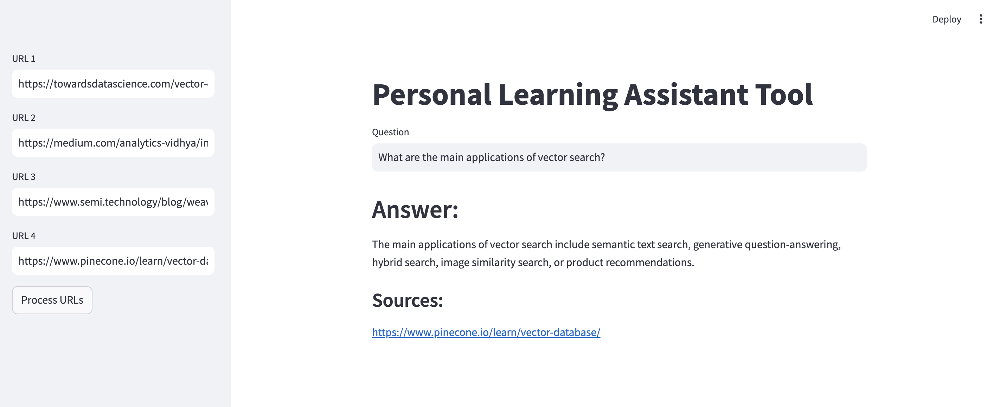

# Learning Assistant for Long-form Blogs (RAG-based)
A GenAI-powered Learning Assistant that uses Retrieval-Augmented Generation (RAG) to read long-form blog articles and provide real-time answers to questions based on their content.

## Overview
This project demonstrates how you can use a combination of web scraping, vector databases, and language models to build a learning assistant. The tool takes blog URLs as input, extracts the content, splits it into chunks, stores them in a vector database, and answers user queries by retrieving the most relevant information from the stored data.

## Features
Web scraping: Input URLs from long-form blog articles.

Retrieval-Augmented Generation (RAG): Combines document retrieval with generative AI to answer questions.

Vector embeddings: Uses Hugging Face's embeddings and Chroma vector database for fast retrieval.

Customizable queries: Answer questions about the content of the blogs, with traceable sources.

Real-time learning: Process any blog articles or technical content for quick learning.

## Tech Stack
- Frontend: Streamlit

- Backend: Python

- Vector Database: ChromaDB

- Language Model: Groq (LLaMA-3.3-70B)

- Embeddings: HuggingFace Embeddings

- Document Loader: UnstructuredURLLoader

- Text Splitting: RecursiveCharacterTextSplitter


## Set-up

1. Clone the repository:

    ```bash
    git clone https://github.com/neethu-codes/learning-assistant-for-blogs.git
    cd learning-assistant-for-blogs
    ```

1. Create and activate a virtual environment:

    ```
    python3 -m venv venv
    source venv/bin/activate  # On Windows, use venv\Scripts\activate
    ```
1. Run the following command to install all dependencies. 

    ```bash
    pip install -r requirements.txt
    ```

2. Create a .env file with your GROQ credentials as follows:
    ```text
    GROQ_API_KEY=GROQ_API_KEY_HERE
    ```

3. Run the streamlit app by running the following command.

    ```bash
    streamlit run main.py
    ```


## Project Structure
```
learning-assistant-for-blogs/
│
├── main.py               # Streamlit app (frontend interface)
├── rag.py                # Core logic for processing URLs, embedding, and answering queries
├── .env                  # Environment variables (for sensitive data like API keys)
├── resources/            # Contains vector store and related resources
│   └── vectorstore/      # Folder where ChromaDB vector store is persisted
├── requirements.txt      # List of required Python packages
└── README.md             # Project documentation
```


## Usage
1. Input URLs:
Enter 1 to 3 URLs from blogs or articles you want to learn from. For example, use URLs of articles about vector databases or machine learning.

2. Process URLs:
Click the ‘Process URLs’ button to extract content from the provided URLs. The assistant will load the data, split it into chunks, and store it in the vector database.

3. Ask Questions:
Once the URLs are processed, you can ask questions about the content. The assistant will use the RAG model to generate answers based on the stored information.

## App Screenshot
